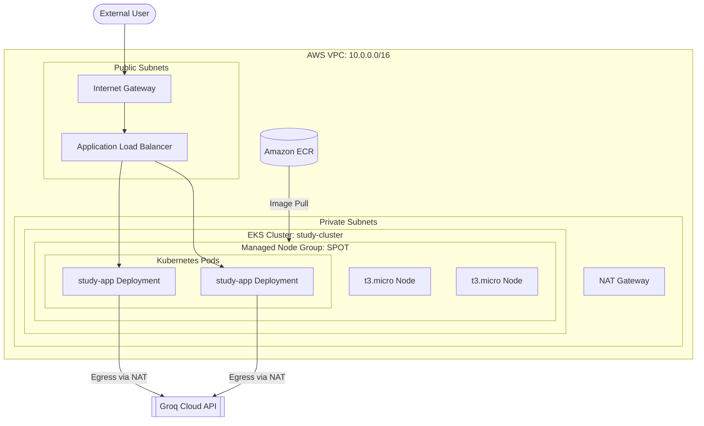
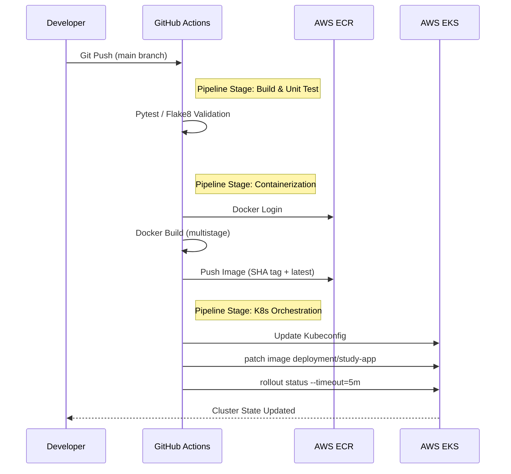

# StudyAI: GenAI-Powered Educational Infrastructure 📚

StudyAI is a cloud-native platform engineered to automate the ingestion and synthesis of educational content. Built on a modular architecture, the system utilizes Large Language Models (LLMs) to perform content summarization, flashcard extraction, and dynamic evaluation generation.

---

## 🏗️ Technical Architecture

### Cloud Ecosystem (AWS)

The infrastructure is provisioned as Immutable Infrastructure via Terraform, deployed within a highly available VPC architecture in the `ap-south-1` region.



### CI/CD Pipeline Logic

The deployment workflow implements an automated build-test-deploy cycle triggered by VCS events.



---

## 🛠️ System Components

### 1. Application Layer (Frontend & Proxy)

- **Framework**: Streamlit (Python-based reactive UI)
- **Containerization**: Docker (Alpine/Slim base images for optimized footprint)
- **Connectivity**: Service exposure via AWS Load Balancer Controller (ALB)

### 2. GenAI Tier (Orchestration & Inference)

- **Orchestration**: LangChain (Chains for Summarization, Flashcard extraction, and Quiz generation)
- **Inference Engine**: Llama-3 (70B/8B Parameter Models) via Groq Cloud for low-latency inference.
- **Data Ingestion**: PyPDF2 for structured document parsing and text extraction.

### 3. Infrastructure Tier (IaC & Orchestration)

- **Provisioning**: Terraform utilizing official `terraform-aws-modules` (VPC, EKS).
- **Orchestration**: Amazon EKS (Kubernetes 1.29) with managed node groups.
- **Networking**: Dual-subnet topology (Public/Private), NAT Gateway for secure egress.
- **Compute**: Spot Capacity (`t3.micro`) to optimize cost in dev environments.

---

## ⚙️ Configuration & Deployment

### Local Development Runtime

1. **Environment Configuration**:

   ```bash
   cat <<EOF > .env
   GROQ_API_KEY=your_api_key
   EOF
   ```

2. **Dependency Management**:

   ```bash
   pip install -r requirements.txt
   ```

3. **Execution**:
   ```bash
   streamlit run app.py
   ```

### Infrastructure Provisioning

```bash
cd terraform
terraform init
terraform apply -auto-approve
```

### GitOps Workflow

The system relies on GitHub Actions (`.github/workflows/deploy.yml`) for continuous deployment. Required secrets:

- `AWS_ACCESS_KEY_ID`
- `AWS_SECRET_ACCESS_KEY`

---

## 📈 Monitoring & Scalability

- **Horizontal Pod Autoscaling**: Configured via Kubernetes manifests.
- **Rollout Strategy**: `Recreate` strategy utilized for resource-constrained (Free Tier) environments to prevent deployment deadlocks.
- **Observability**: Integration with CloudWatch Container Insights planned for production metrics.
